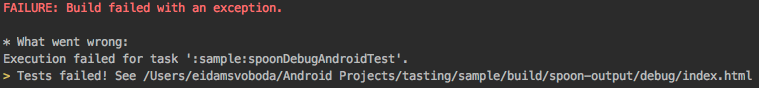
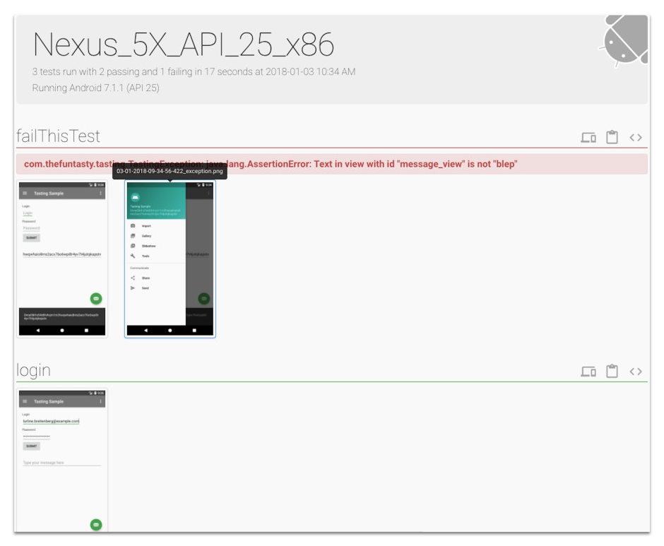

# Tasting #

[](https://jitpack.io/#thefuntasty/tasting)

Tasting is Android library which simplifies writing UI tests and wraps [Spoon](https://github.com/square/spoon) screen capturing, so you can take screenshots in your tests and see them in HTML report aftewards.


## Installation

Add JitPack and Spoon plugin to your root `build.gradle`:

```groovy
allprojects {
    repositories {
        ...
        maven { url "https://jitpack.io" }
        maven { url "https://oss.sonatype.org/content/repositories/snapshots" }
    }
    dependencies {
    	...
    	classpath "com.jaredsburrows:gradle-spoon-plugin:1.0.0"
    }
}
```
Apply Spoon plugin:
```groovy
apply plugin: 'spoon'
```

Configure Spoon:
```groovy
spoon {
    debug = true
    noAnimations = true
    grantAllPermissions = true
}
```

Add the dependencies you need:
```groovy
androidTestImplementation 'com.github.thefuntasty:tasting:latestVersion'
androidTestImplementation 'com.android.support.test:runner:1.0.2'
androidTestImplementation 'com.squareup.spoon:spoon-client:1.7.1'
```

## Usage

### Implementation

1. Create `BaseScenario` class (extending `Scenario`) in `androidTest/` directory
2. Override `beforeSetUp()` method where you can change bot settings or delete persistent data (to make every test start from the same initial state)
3. Override `afterSetUp()` method where you can make bot wait for app to load
```kotlin
open class BaseScenario : Scenario() {

    override fun beforeSetUp() {
        bot.scrollThreshold = SCROLL_THRESHOLD
        bot.viewTimeout = VIEW_TIMEOUT
        //delete persistence here
    }

    override fun afterSetUp() {
        bot.waitForId(bot.getViewId(R.id.login_button), LAUNCH_TIMEOUT)
    }
}
```

4. Create eg. `AccountScenario` class (extending `BaseScenario`) which will contain all tests regarding user account

```kotlin
@RunWith(AndroidJUnit4::class)
class SampleScenario : BaseScenario() {

    @Test
    fun login() {
        bot.writeById(bot.getViewId(R.id.login_field), bot.email)
        bot.writeById(bot.getViewId(R.id.password_field), bot.getRandomString(21))
        bot.tapById(bot.getViewId(R.id.login_button))

        bot.presentById(bot.getViewId(R.id.login_check))
        bot.takeScreenshot("loggedIn")
    }
}
```

### Running tests

1. Open terminal at your Android project directory
2. Run `./gradlew spoonDebug` (or specify any other build variant eg. `spoonClient`)

### Checking results

1. You can see test progress and result in terminal window



2. After finishing all tests, interactive HTML test report is generated in your project directory (`build/spoon-output/...`), including screenshots you took with `bot.takeScreenshot()` method. Screenshot is also taken automatically on test failure, so you can find out what went wrong easier.



## Contributors

Current maintainer and main contributor is [Adam Svoboda](https://github.com/IntergalacticPenguin), <adam.svoboda@futured.app>.

## License

Tasting is available under the MIT license. See the [LICENSE](LICENSE) for more information.
